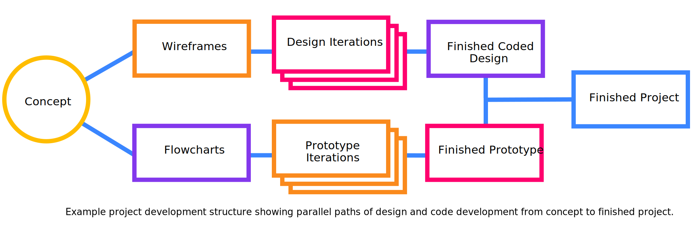

# DIG 245 Final Project

Design and program a web application as a creative response to content from the course.

<details>
<summary>Learning Objectives</summary>

Students who complete this assignment will be able to:

- Recall important social, political, and economic issues around design, the internet, and computing.
- Research, ideate, and plan a creative response to themes from the course content.
- Use design processes (grids, typography, design principles, and iteration) to create a custom responsive web application design.
- Use HTML, CSS, JS, and any additional frameworks or libraries to create a custom web application.

</details>

<details>
<summary>Preparation</summary>

Complete the following to prepare for this assignment. See [Resources](#resources) for additional information as needed.

- Codecademy JS references [jquery introduction](https://github.com/omundy/learn-javascript/blob/main/reference-sheets/jquery-01-introduction.pdf), [effects](https://github.com/omundy/learn-javascript/blob/main/reference-sheets/jquery-02-effects.pdf), [jquery events](https://github.com/omundy/learn-javascript/blob/main/reference-sheets/jquery-03-events.pdf), [style methods](https://github.com/omundy/learn-javascript/blob/main/reference-sheets/jquery-04-style-methods.pdf), [dom traversing](https://github.com/omundy/learn-javascript/blob/main/reference-sheets/jquery-05-dom-traversing.pdf)
- [Codecademy: JS 7-1 Higher-Order Functions](https://www.codecademy.com/learn/introduction-to-javascript) (1-4)
- [Codecademy: JS 7-2 Iterators](https://www.codecademy.com/learn/introduction-to-javascript) (1-9)
- [Codecademy: JS 8-1 Objects](https://www.codecademy.com/learn/introduction-to-javascript) (1-10)

</details>

<details>
<summary>Rubric</summary>


The final grade incorporates preparation scores with the final score ([rubric](https://docs.google.com/document/d/1gqAB_AHkMC6uKr_1uP9JzPwWclABw1RAB7KwEgAQSds/edit)).

```js
let milestones = ((concept + proposal + prototype + design) / 4) * 0.2;
let grade = milestones + (deliverables * 0.8);
```

</details>


## About


We’ve examined several issues around design and the internet this semester. Some forms are easy to identify, like how dark patterns manipulate user experiences by affecting usability and user expectations. Others, like the relationship between the surveillance economy and social justice are harder to visualize, but equally important when we consider whether the internet is or is not a positive force in society.

At the beginning of the semester, the [View Source](https://github.com/omundy/dig245-view-source) assignment asked you to think about why it is important to be able to know how a web page works “under the hood.” This final assignment challenges you to further investigate one or more of your preferred themes (from or related to the course) and conceive of and build a creative response in the form of a web application that likewise makes the topic more understandable, relevant, or transparent.

Your application will consist of HTML, CSS, Javascript, and any additional libraries you may need, but it should address the topic through an interactive experience that involves a user somehow inputting data, and your app transforming that data to reveal insights into your chosen topic.


## Instructions

Fork this repository and clone it to your `critical-web-design` folder on your machine.


<!--

[project development template](https://github.com/omundy/project-development-template)

-->




## 1 - Concept

*Identify a topic, collect research, prepare a summary for a brainstorming session.*

1. **Identify potential topics** to explore. It shouldn't be too specific, nor too broad. Is there a specific problem you want to solve? Or do you wish to address issues by [problematizing](https://en.wikipedia.org/wiki/Problematization) your subject?
1. **Collect research** (related articles, etc.) **and inspiration** (2-3 links or summaries of similar projects). Look at the [Critical Web Design / Radical Software Example Works](https://docs.google.com/spreadsheets/d/1mQ0doWT6tGXm2W-hB5zuz3I8mijGhLSkAe_XrcfMdok/edit#gid=0) for ideas or this list of [](https://www.awwwards.com/25-non-profit-and-social-driven-websites.html).
1. **Identify new skills or technologies** (e.g. a design method, programming pattern, code library, etc.) you are interested to learn and could potentially use in your project.
1. **Write a summary** of your topic(s), research, and technology (3–4 sentences). Address why you are drawn to this topic and why it is important to explore. Identify the communities, resources, and issues involved. What [frameworks](https://docs.google.com/presentation/d/1OWc_e1pquvwKi4qxJShsZ1Rqia1dbDBcwpxYwdOic7o/edit#slide=id.g165f853ab3b_0_0) or methodologies might you use?
1. Bring the above to class for the...

<details>
<summary>In-class activity</summary>

In groups, brainstorm on your topic(s) use the <a href="https://omundy.github.io/project-development-template/materials/brainstorming-disney-method/index.html" target="_blank">Disney Creative Strategy</a>, which asks your group to assume different "hats" in order to ideate on concepts, solutions, and risks.

1. Everyone: post your subject or concept in Slack
1. As Dreamers, add new ideas for projects based on the subject to the posts in your group
    - How might you create something that helps others discuss, think about, or help to solve the issue?
    - The more ideas the better. Brainstorming aims to produce quantity, from which we select quality ideas.
    - No criticism. Our goal is to generate a pool of ideas. All ideas are welcome.
1. As Realists, after all have posted, talk about each in a group
    - Think more practically, about how you would put the ideas into practice.
1. After the session, explore the ideas and notes as a critic, to figure out what you can build in the given time

</details>


## 2 - Proposal

Create a pitch deck (10-15 slide Google Presentation) to share and plan your project that contains:

1. A one paragraph introduction to your concept and what you plan to make. Who will use this and why?
1. An initial attempt at an [identity](https://docs.google.com/presentation/d/1exnY8fjVsOc3bKZFESJIM2s4JKxhqg_oASPDPokSfrE/edit?usp=sharing) (e.g. a logo, word mark, style guide, etc.).
1. Competition Scan - Examples (2–3) of similar works (in concept or tech) with images and links.
1. Flowcharts (2–3) showing each step users see, and another [showing how data works](https://www.google.com/search?q=a+flowchart+that+tracks+data+through+the+app&safe=off&tbm=isch) in the app
1. [Wireframes](https://www.dreamhost.com/blog/how-to-wireframe-website/) showing all the views in the interface (introduction page, forms, results page)
1. Technology - Include [pseudocode](https://en.wikipedia.org/wiki/Pseudocode) of the main logic of your project. List technologies and demos you think you will need. List the "**unknowns**"—parts of your idea that you don't know yet how to execute.


<details>
<summary>In-class activity (lightening talks)</summary>

##### <a href="https://en.wikipedia.org/wiki/Lightning_talk">Lightning talks</a> of your pitches
1. Share a link to your proposal in Slack.
1. Present slides on Zoom. 3 minutes max.
1. 1 minute max for questions / comments. Add others in Slack thread.

</details>

<details>
<summary>In-class activity (speed dating)</summary>

##### Speed Dating

1. Find a partner.
1. Share your proposal, progress, and unknowns. (3 min)
1. Your partner should ask questions and make comments while you make notes. (1 min)
1. Switch roles and repeat the above.
1. Switch partners and repeat.

</details>


## 3 - Prototype

Create a working “proof of concept” of your app.

1. Your prototype should contain the essential functions of your project.
1. Your work should be live (not public, just able to be shared via a link in Slack)
1. Feel free to fork and use any example repository from class to get started.


<details>
<summary>In-class activity</summary>

In groups, share your prototypes to get feedback:

- Be ready to explain the current status of your work.
- Bring specific questions or unknowns (concept, design, tech) you would like to discuss with your group.

</details>


## 4 - Design

Design iterations of main views.

1. The design should reflect the overall concept and goals of your project.
1. Create your design iterations with [Figma](https://figma.com), or use the Bootstrap template included in this repo `designs/1.psd`.
1. Create multiple iterations of each different page / view your app.
1. As per class [presentations](https://docs.google.com/presentation/d/1BiIHVEQjmIb2k2vB6N3x1g_S3KSLyZq2YCniq1ONjg8/edit?usp=sharing), look at relevant examples of good design to help you improve your own, then experiment and iterate!


<details>
<summary>In-class activity</summary>

Share your iterations to get feedback before coding the final design.

- Bring to class: What are three questions you would like to ask each user of your potential design?
- In-class: [Design Critique: Imaginary Audience](https://docs.google.com/presentation/d/1BiIHVEQjmIb2k2vB6N3x1g_S3KSLyZq2YCniq1ONjg8/edit#slide=id.gf16dac508b_0_0)

</details>


## 5 - Deliverables

Your finished project should include:

1. The Project:
    1. Intro page: A well-designed, but simple page that contextualizes your project. It could appear as an introduction to the project or provided at the end to explain what happened.
    1. Your coded design (valid [HTML](https://validator.w3.org/) and [CSS](https://jigsaw.w3.org/css-validator/)) combined with your prototype in a final application.
    1. The project should be live, hosted on Github Pages, Heroku, or your own server.
1. Documentation:
    1. A presentation (update your original proposal with screenshots, text, flowcharts, etc.) to document and share your finished project.
    1. A video (1:30 max) in case your site breaks 😳
    1. A 200–300 word statement explaining your concept and execution. This can be posted in Moodle, or included somehow in the actual project (e.g. the Intro page).
    1. See more about [documentation](https://omundy.github.io/learn-computing/slides/documentation.html)


<!--
Examples:

[Probability football](https://docs.google.com/presentation/d/1QO5ZFlc8GQilGughUaI57RlhQKc8TWECiqR7wkwjTwQ/edit#slide=id.p)

-->

<details>
<summary>In-class activity</summary>

We will share final projects in <a href="https://en.wikipedia.org/wiki/Lightning_talk">lightning talks</a> (3 min.)

</details>


## 6 - Publish

1. [Save and refresh](https://github.com/omundy/learn-computing/blob/main/topics-keyboard-shortcuts.md#web-development-edit-save-refresh-loop) your work in the browser often to see your changes.
1. Commit changes regularly.
1. Confirm valid [HTML](https://validator.w3.org/) and [CSS](https://jigsaw.w3.org/css-validator/) <sup>([?](https://github.com/omundy/dig245-critical-web-design/blob/main/topics/html-css/css.md#css-validation))</sup>
1. When finished, [push, publish, and post your project](https://docs.google.com/document/d/17U_zmzM_eML_qkG0PaOdDRcEk3YEmbiQ1TyNnbAM08k/edit#bookmark=id.8jryplv1i8a). Make sure to include a link to your Figma designs in the Moodle post.


## Resources

- Course references [HTML](https://github.com/omundy/dig245-critical-web-design/blob/main/topics/html-css/html.md), [CSS](https://github.com/omundy/dig245-critical-web-design/blob/main/topics/html-css/css.md), and [JS](https://github.com/omundy/dig245-critical-web-design/blob/main/topics/javascript/javascript.md)
